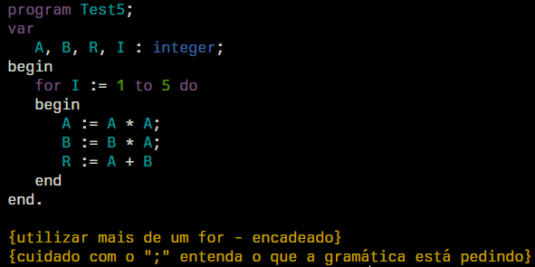
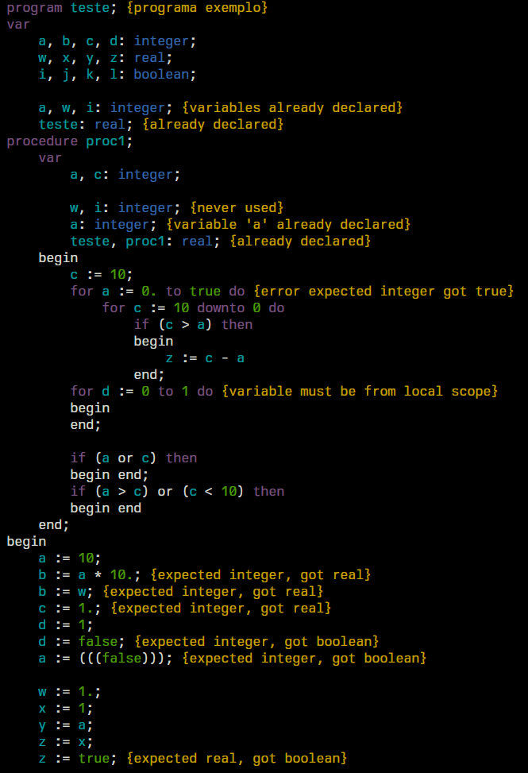

# Projeto final de compiladores

Parser, analisador semântico, formatador e
syntax highlighter de (um subset de) Pascal

## Grupo
- Felipe Lemos
- Manoel Amaro

## Requisitos
- Node.js v20.13.0 ou mais novo

## Como rodar
Use `node index.js` para ver as instruções de uso ou veja abaixo:

- `node index.js ./arquivo/pascal.js` para rodar o parser e analisador semântico
- `node index.js --format ./arquivo/pascal.js` para executar o formatador
- `node index.js --highlight ./arquivo/pascal.js` para executar o syntax highlighter

# Parser e analisador semântico
O parser e lexer estão em `parser.js` e o analisador semântico em `semantic.js`

É o mesmo apresentado como primeiro projeto da disciplina,
funciona apenas pra um subset de Pascal e conta com
recuperação de erros (limitada). É um parser top-down
recursivo e embora seja mais lento que um parser bottom-up, é preferível porque é mais fácil produzir mensagens de
erro boas.

## Exemplo recuperação de erro
No geral quando ocorre um erro sintático o parser entra
em modo de 'pânico' e dependendo de onde está, tenta encontrar
um símbolo para sincronizar. Se o parser estiver dentro
de um bloco de comando e algum dos comandos retornar um erro,
ele vai procurar o próximo ';' para sincronizar e continuar
a analisar o resto do código.

Entrada:
```pascal
program teste;
var
    a, b : integer;
    c : real;
begin
    c := ** 10; {Expressao mal formada}
    b := 10 +; {Expressao mal formada}
    a := -1
end.
```
Saída:
```
./instances/teste.pas:6:10: Expected factor, got '*'.
./instances/teste.pas:7:14: Expected factor, got ';'.
[...]
```

## Exemplo de avisos de uso de varíavel

O analisador Semântico além do básico avisa sobre variáveis
que não foram utilizadas (que seu valor não foi lido) e que
foram lidas mas ainda não tiveram valor atribuído.

Entrada:
```pascal
program teste;
var
    {Varíavel b atribuída mas nunca usada}
    {Variável c não foi usada}
    a, b, c : integer;
begin
    {Acessando variável que ainda não foi atribuída}
    b := a * 10;
    a := 1
end.
```
Saída:
```
./instances/teste.pas:5:8: Variable 'b' was never used.
./instances/teste.pas:5:11: Variable 'c' was never used.
./instances/teste.pas:8:10: Variable 'a' was not initialized.
```

# Formatador
O formatador está em `formatter.js` e segue a estrutura do parser top-down só que ao invés de ler tokens e construir a árvore ele usa a árvore sintática pronta e então escreve num arquivo seguindo as regras de formatação.

No geral queremos que os tokens estejam sempre separadas por um espaço em branco, como nas expressões. Alguns casos, como em `(a + b + c)` e `a := b;` alguns dos tokens não tem separação.

Por padrão os códigos são indentados com espaços e usando 4 espaços, na declaração de variáveis cada declaração de um tipo fica em um linha diferente e sempre em um nível de indentação a mais que a keyword 'var', a mesma regra se aplica para várias outras estruturas.

Quando há blocos de comando com 'begin' e 'end', estas duas keywords ficam no mesmo nível da estrutura que iniciou o bloco e conteúdo fica entre eles com um nível a mais de indentação.

Para ter uma separação melhor do que faz parte de uma procedure (ou o programa principal) e as procedures que ela cria, toda declaração de procedure faz todo seu conteúdo aparecer em um nível a mais de indentação.

A formatação de comentários ainda não está completamente correta, primeiro tivemos que mudar o lexer para retornar um símbolo de comentário que não é incluído na árvore sintática final mas é coletado pelo formatador. Dessa maneira podemos ter uma certa noção de aonde mais ou menos os comentários ficam mas poderia ser mais precisa se as posições de todos os tokens fosse guardada nos nós da árvore. No nó de bloco de comando, por exemplo, guardamos o símbolo 'begin' mas não guardamos o 'end', então podemos saber que um comentário está depois do bloco mas não o quão longe o 'end'.

O formatador também elimina as linhas em branco entre linhas de código por simplicidade.

## Exemplo de formatação de código

Entrada:
```pascal
program Test1;
var Area, Comprimento, Raio:real;
procedure teste (A:integer; B:real);
var
   S,X: real;
begin
   S := A + B * X
end;

begin
Raio :=4 ;

Area :=3.14 * Raio * Raio;
Comprimento := 2*3.14*Raio
end. {comentario}
```

Saída:
```pascal
program Test1;
var
    Area, Comprimento, Raio : real;
procedure teste (A : integer; B : real);
    var
        S, X : real;
    begin
        S := A + B * X
    end;
begin
    Raio := 4;
    Area := 3.14 * Raio * Raio;
    Comprimento := 2 * 3.14 * Raio
end.
{comentario}
```

# Syntax highlighter
Está definido em `highlighter.js` e as cores em `colors.js`

O syntax highlighter lê o código fonte e o printa na tela pelo stdout, usando "ANSI escape codes" para definir a cor de cada token de acordo com seu tipo. As keywords, comentarios, variaveis e literais de valores (real, inteiro e boolean) são coloridas enquanto o resto mantém a cor padrão.

Recebe como entrada a árvore sintática e o caminho do arquivo com o código fonte. Percorrendo os nós da árvore, o programa coleta cada símbolo na árvore a ser colorido, imprime na tela o conteúdo do arquivo até aquele símbolo e então printa o símbolo com a cor definida. Após o último símbolo ser escrito o resto do arquivo é printado na tela.

## Screenshots

---

